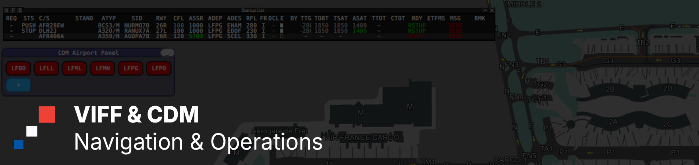

# 🇫🇷 French vACC vIFF-CDM Configuration

Welcome to the official repository for the **French vACC vIFF-CDM
configuration** used on the **VATSIM network**.

This repository supports the **distribution, maintenance, and automatic
generation** of Collaborative Decision Making configuration data for supported
French airports. Airport-specific source files are kept together, while the
live files consumed by vIFF-CDM are generated automatically.

---

> ⚠️ **Generated Files**
>
> `rate.txt`, `sidInterval.txt`, and `taxizones.txt` are generated files and
> should not be edited directly.
>
> Make changes in the relevant `Airports/<ICAO>/` directory instead.

> 💡 **Automatic Generation**
>
> After a change is pushed to `main`, a GitHub Actions workflow merges the
> airport data, rebuilds the live files, and commits updated outputs back to
> `main` automatically.

---

## 📂 Live Configuration Files

The latest live configuration is always available from the `main` branch:

| File | Description |
| --- | --- |
| [`CDMconfig.xml`](https://raw.githubusercontent.com/vaccfr/vIFF-CDM/refs/heads/main/CDMconfig.xml) | Main EuroScope vIFF-CDM plugin configuration |
| [`ctot.txt`](https://raw.githubusercontent.com/vaccfr/vIFF-CDM/refs/heads/main/ctot.txt) | Associates CTOTs with CIDs during slotted events |
| [`rate.txt`](https://raw.githubusercontent.com/vaccfr/vIFF-CDM/refs/heads/main/rate.txt) | Airport rates for each runway configuration |
| [`sidInterval.txt`](https://raw.githubusercontent.com/vaccfr/vIFF-CDM/refs/heads/main/sidInterval.txt) | Minimum departure intervals between SID combinations |
| [`taxizones.txt`](https://raw.githubusercontent.com/vaccfr/vIFF-CDM/refs/heads/main/taxizones.txt) | Taxi times by airport area and departure runway |

---

## 🗺️ Supported Airports

### 🟦 LFBB — Bordeaux FIR

- **LFBO** — Toulouse Blagnac

---

### 🟥 LFFF — Paris FIR

- **LFPG** — Paris Charles de Gaulle
- **LFPO** — Paris Orly

---

### 🟨 LFMM — Marseille FIR

- **LFLL** — Lyon Saint-Exupéry
- **LFML** — Marseille Provence
- **LFMN** — Nice Côte d'Azur

---

## 🗂️ Repository Structure

Each supported airport has its own source directory:

```text
Airports/
└── <ICAO>/
    ├── capacity.txt
    ├── interval.txt
    ├── procedures.txt
    ├── rate.txt
    └── TaxiAreas.geojson
```

The automation scripts are stored together in `scripts/`, while the workflow
definition is stored in `.github/workflows/`.

---

## 🛠️ Updating Airport Data

Update the source files inside the relevant airport directory:

- `interval.txt` is merged into the root `sidInterval.txt`;
- `rate.txt` is merged into the root `rate.txt`; and
- `TaxiAreas.geojson` is converted and merged into the root `taxizones.txt`.

Every taxi-area feature must have an `icao` property matching its airport
directory. The build stops if a required source is missing or a feature is
stored under the wrong airport.

Airport directories are processed in alphabetical ICAO order.

---

## ⚙️ Local Build

To regenerate the three live files locally, run the following command from the
repository root:

```shell
python scripts/build_live_files.py
```

The build uses only the Python standard library; no additional packages are
required.

---

## 🤝 Contributing

Contributions are welcome. See the
[contribution guidelines](CONTRIBUTING.md) for airport source requirements,
local validation, and the pull-request checklist.
